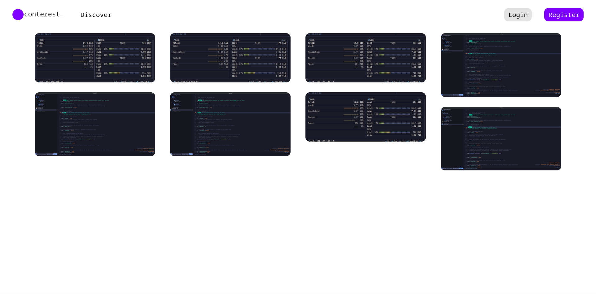

# Conterest
Conterest is an application that allows users to save, share, and restore their config.

## Features
1. Using builtin django auth views.
2. Using Postgresql database.

## Goals
- [x] Create django app designated to user authentication.
- [x] Use Postgresql.
- [x] Make appeling UI.
- [x] Display config thumbnails in pretty format.
- [ ] Implement API in djangorestframework.
- [ ] ...